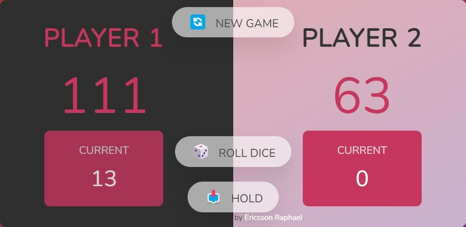

# Pig Game

## Table of contents

- [Overview](#overview)
  - [About](#about)
  - [Game Conditions](#game-conditions)
  - [The Challenge](#the-challenge)
  - [Features](#features)
  - [Updates](#updates)
  - [Screenshots](#screenshots)
  - [Links](#links)
- [My process](#my-process)
  - [Built with](#built-with)
- [Author](#author)
- [Acknowledgments](#acknowledgments)

## Overview

### About

Pig is a straightforward, amusing, and funny dice game for two players. The goal of the game is to be the first to score 100 points.

### Game Conditions

- The player rolls the dice again each time until either a 1 is rolled or the player chooses to "hold"
- The player's turn ends and the next person takes over if they roll a 1.
- The player's turn continues if they roll any other number, which is added to their turn total.
- It becomes the following player's turn if they decide to "hold," in which case their turn total is added to their overall score.

### The Challenge

My goal was to recreate Jonas' Pig Game from scratch and make some updates to it.

### Features

- Generate random dice digit per player click
- Automatic turn switch when the dice rolls to a 1
- New game button to reset game

### Updates

- Responsive Web Design across all Devices
- Rolling Dice Functionality

### Screenshots

### Links

- Code URL: [Github Repo here](https://github.com/gitEricsson/Pig-Game)
- Live Site URL: [Live site here](https://ericsson-pig-game.netlify.app/)

## My process

### Built with

- Semantic HTML5 markup
- CSS custom properties
- Flexbox
- CSS Grid
- TypeScript

## Author

- Website - [Ericsson Raphael](https://github.com/gitEricsson)
- LinkedIn - [@ericsson](www.linkedin.com/in/ericssonraphael)
- Gmail - [@ericsson](ericssonraphael@gmail.com)

## Acknowledgments

[Jonas Schmedtmann](https://github.com/jonasschmedtmann)
